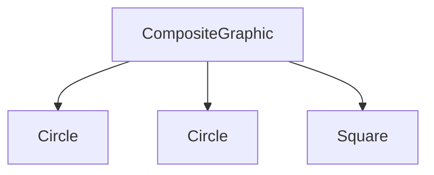

# Composite Design Pattern


The Composite Design Pattern is a structural pattern that allows you to compose objects into tree structures to represent part-whole hierarchies. This pattern lets clients treat individual objects and compositions of objects uniformly.

## When to Use

How do we use Individual type of objects to build a tree like structure?
- When you need to represent a part-whole hierarchy of objects.
- When you want clients to be able to ignore the difference between compositions of objects and individual objects.
- When you need to simplify the client code that deals with complex tree structures.

## Pros
- Simplifies client code by allowing uniform treatment of individual objects and compositions.
- Makes it easier to add new kinds of components.
- Promotes code reusability and flexibility.

## Cons
- Can make the design overly general.
- Can be difficult to restrict the types of components in a composite.

## Example


```java
// Component
interface Graphic {
    void draw();
}

// Leaf
class Circle implements Graphic {
    @Override
    public void draw() {
        System.out.println("Drawing Circle");
    }
}

// Leaf
class Square implements Graphic {
    @Override
    public void draw() {
        System.out.println("Drawing Square");
    }
}

// Composite
class CompositeGraphic implements Graphic {
    private List<Graphic> childGraphics = new ArrayList<>();

    public void add(Graphic graphic) {
        childGraphics.add(graphic);
    }

    public void remove(Graphic graphic) {
        childGraphics.remove(graphic);
    }

    @Override
    public void draw() {
        for (Graphic graphic : childGraphics) {
            graphic.draw();
        }
    }
}

// Client
public class CompositePatternDemo {
    public static void main(String[] args) {
        Circle circle1 = new Circle();
        Circle circle2 = new Circle();
        Square square = new Square();

        CompositeGraphic composite = new CompositeGraphic();
        composite.add(circle1);
        composite.add(circle2);
        composite.add(square);

        composite.draw();
    }
}
```




## Recursive Composition

Recursive composition is a design principle where a complex object is composed of simpler objects of the same type. This principle is fundamental to the Composite Design Pattern, as it allows you to build complex structures by recursively composing simpler components.

In the context of the Composite Design Pattern, recursive composition enables the creation of tree-like structures where both individual objects (leaves) and compositions of objects (composites) can be treated uniformly. This uniform treatment simplifies client code and enhances flexibility.

For example, in the file system example provided earlier, directories can contain both files and other directories. This recursive composition allows the client to interact with the file system in a consistent manner, regardless of the complexity of the structure.

By leveraging recursive composition, the Composite Design Pattern promotes code reusability and makes it easier to manage complex hierarchical structures.
