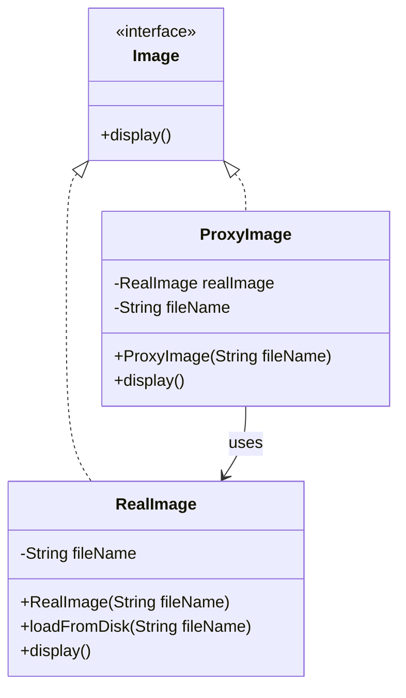
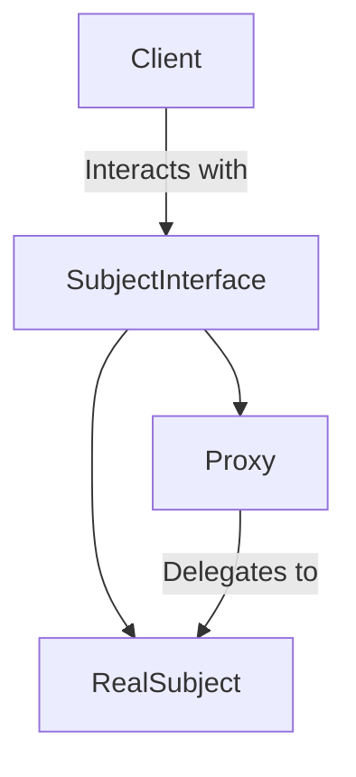

Proxy Pattern


## Proxy Pattern Example in Java

Here is a simple example of the Proxy Pattern in Java:

```java
// Step 1: Create an interface.
interface Image {
    void display();
}

// Step 2: Create concrete classes implementing the same interface.
class RealImage implements Image {
    private String fileName;

    public RealImage(String fileName) {
        this.fileName = fileName;
        loadFromDisk(fileName);
    }

    private void loadFromDisk(String fileName) {
        System.out.println("Loading " + fileName);
    }

    @Override
    public void display() {
        System.out.println("Displaying " + fileName);
    }
}

// Step 3: Create a proxy class implementing the same interface.
class ProxyImage implements Image {
    private RealImage realImage;
    private String fileName;

    public ProxyImage(String fileName) {
        this.fileName = fileName;
    }

    @Override
    public void display() {
        if (realImage == null) {
            realImage = new RealImage(fileName);
        }
        realImage.display();
    }
}

// Step 4: Use the ProxyImage to get object of RealImage class when required.
public class ProxyPatternDemo {
    public static void main(String[] args) {
        Image image = new ProxyImage("test_image.jpg");

        // Image will be loaded from disk
        image.display();
        System.out.println("");

        // Image will not be loaded from disk
        image.display();
    }
}
```

In this example, `ProxyImage` is used to access the `RealImage` object. The `RealImage` object is only created when it is needed, which can save memory and processing time.

## Proxy Pattern Diagram

Here is a simple diagram to understand the Proxy Pattern:



In this diagram:
- `Image` is an interface with a `display` method.
- `RealImage` is a concrete class that implements the `Image` interface and represents the actual object that needs to be created.
- `ProxyImage` is a proxy class that also implements the `Image` interface and controls access to the `RealImage` object.

The `ProxyImage` class holds a reference to the `RealImage` object and creates it only when it is needed, thus saving resources.

Example: question


